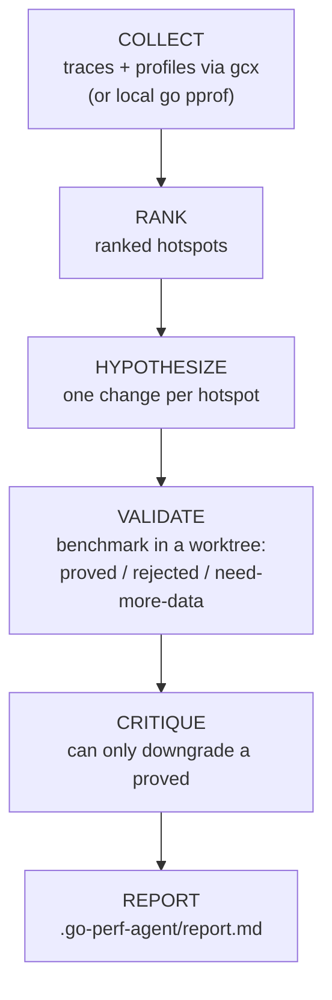

# go-perf-agent

go-perf-agent is a tool to find optimizations and optimizes Go codebase from production telemetry and local benchmarks, it tells you about the hotspots,
and makes code changes with optimizations based on the ground truths.

The tool does the deterministic work (collect telemetry, rank hot code, run the benchmark gate), and then agents hypothesize a change, apply it, and benchmark it. Then the data is used to decide what is worth shipping.

It is traces-first: via [`gcx`](https://github.com/grafana/gcx) it queries [Tempo](https://github.com/grafana/tempo) traces to locate the slow operation,
then uses [Pyroscope](https://github.com/grafana/pyroscope) profiles to find the hot code.

No access to production telemetry (no `gcx`)? It falls back to profiling locally with [`pprof`](https://pkg.go.dev/runtime/pprof).

> [!NOTE]
> Alpha software, provided as-is with no warranty and liability. Use at your own risk.
> It's a personal project and not affiliated with or endorsed by my employer.

## How it works

The Claude skill orchestrates the agents, and the Go binary does the deterministic work. Stages
connect through files under `.go-perf-agent/`, not direct messages.



`bench regression` (base-vs-head) is a separate entry point.

## How to use

Run it as a Claude Code agent driven by the skill in this repo. The target repo you want to audit
is added to the session as an extra directory, so you do not copy anything into it.

1. Clone and build:
   ```bash
   git clone https://github.com/electron0zero/go-perf-agent
   cd go-perf-agent
   make build   # builds ./go-perf-agent (or: go build -o go-perf-agent ./cmd/go-perf-agent)
   ```
2. Run Claude Code from this repo (so its `.claude/` skill and agents load), adding the target Go
   repo(s) as extra working directories:
   ```bash
   claude --add-dir /path/to/target-repo # (or `/add-dir /path/to/target-repo` inside an existing session.)
   ```
3. Run `go-perf-agent check` to check your tools (`go`, `git`, `benchstat`, a recent `gcx`) and see
   what is missing.
4. Invoke the `go-perf-agent` skill and tell it what to audit (a service + window, a PR, or a local
   diff). It drives the whole loop and writes `.go-perf-agent/report.md` in the target repo.

## Prerequisites

Tools on PATH (run `go-perf-agent check` to check):

| tool | version | needed for                                                             |
|---|---|------------------------------------------------------------------------|
| `go` | 1.23+ | building/running go-perf-agent and benchmarks                          |
| `git` | 2.5+ | per-hypothesis worktrees, diff modes                                   |
| `benchstat` | latest | the numeric gate (`go install golang.org/x/perf/cmd/benchstat@latest`) |
| `gcx` | v0.4.2+ | production telemetry (optional; local profiling works without it)      |
| `gh` | latest | for PR diff mode only                                                  |

Production telemetry needs gcx v0.4.2+ (`go install github.com/grafana/gcx/cmd/gcx@latest`),
authenticated with `gcx auth login`. Earlier builds lack the required `tempo query` /
`pyroscope exemplars` / `pyroscope query -o pprof`. No gcx? `collect local` profiles with `go pprof`.

## Use cases

The same benchmark gate runs from three starting points:
1. Production telemetry: point it at a service + time window; it finds the prod hot path
  and proposes code-level wins. Best when the service has Tempo + Pyroscope telemetry.
2. A GitHub PR: review the changed code for optimizations, and check the PR did not make a changed
  function slower (`bench regression`).
3. A local diff: the PR case for your own uncommitted work before you open a PR.

No gcx, or don't want to grant telemetry access? Use local mode (`collect local` then `hotspots`)
on a package you name. It works best with production telemetry, or when you already know the
package or function you want to optimize.

## Caveats

- Every finding is a hypothesis. A PROVED verdict is a local-benchmark win, not truth: production
  has different hardware, inputs, and load - re-check the same telemetry in prod before trusting it.
- Results are only as good as the machine. A noisy laptop widens confidence intervals; run on an
  idle machine on power (not battery) for stable results.
- Without `scope`, the whole codebase is in play; use `--include`/`--exclude` to keep agents off
  vendored, generated, or frozen packages.
- Proved changes are left in throwaway worktrees under `.go-perf-agent/wt/` for you to review and
  cherry-pick.

## Acknowledgements and sources

Built with open source: [Tempo](https://github.com/grafana/tempo),
[Pyroscope](https://github.com/grafana/pyroscope), the [`gcx`](https://github.com/grafana/gcx) CLI,
Go's [`pprof`](https://pkg.go.dev/runtime/pprof) and
[`benchstat`](https://pkg.go.dev/golang.org/x/perf/cmd/benchstat), and
[`alecthomas/kong`](https://github.com/alecthomas/kong).

The pattern catalog and methodology are built from these sources:

- [Dave Cheney's High Performance Go Workshop](https://dave.cheney.net/high-performance-go-workshop/dotgo-paris.html)
- [Bryan Boreham's workshop fork](https://github.com/bboreham/high-performance-go-workshop)
- [Go wiki: Performance](https://go.dev/wiki/Performance)
- [Profiling Go Programs (the pprof blog)](https://go.dev/blog/pprof)
- [Go optimization guide (goperf.dev)](https://goperf.dev/)
- [Damian Gryski's go-perfbook](https://github.com/dgryski/go-perfbook/blob/master/performance.md#writing-and-optimizing-go-code)
- [Guide to the Go GC](https://go.dev/doc/gc-guide)
- [Eben Freeman, "Garbage Collection"](https://youtu.be/M0HER1G5BRw)
- [Bryan Boreham, "Obscure Go Optimisations"](https://youtu.be/rRtihWOcaLI)
