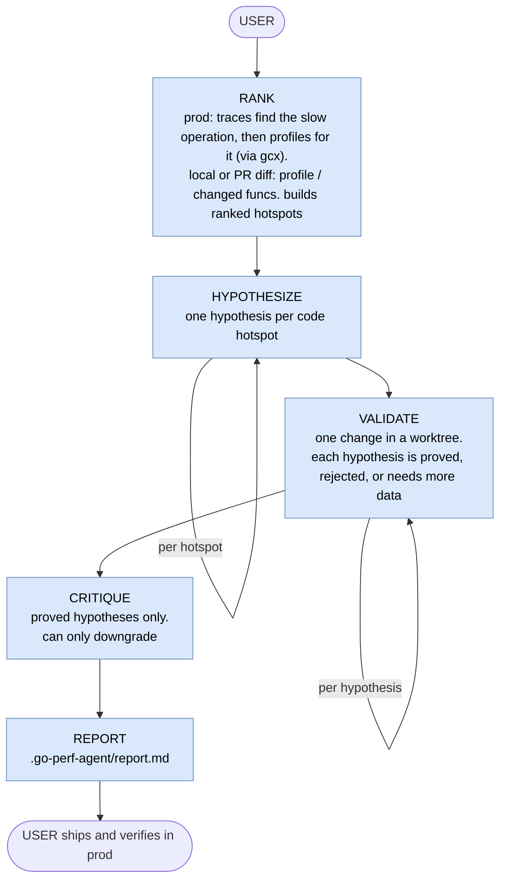

# go-perf-agent

go-perf-agent finds where a Go service is slow from real telemetry, proposes one optimization at a
time, and reports it as proven only when [`benchstat`](https://pkg.go.dev/golang.org/x/perf/cmd/benchstat)
says so. You get a short, grounded list worth shipping instead of speculation.

It is a hybrid: a single Go binary does the deterministic work (collect telemetry, rank hot code,
run an interleaved benchmark gate), and a [Claude Code](https://docs.claude.com/en/docs/claude-code)
skill plus four agents do the reasoning (form a hypothesis, apply one change, author a missing
benchmark). Hard numbers decide keep or reject, never the model.

Data comes from the Grafana stack via the [`gcx`](https://github.com/grafana/gcx) CLI:
[Tempo](https://github.com/grafana/tempo) traces find the slow operation, then
[Pyroscope](https://github.com/grafana/pyroscope) profiles explain it at the code level. With no
`gcx`, it falls back to a local [`go pprof`](https://pkg.go.dev/runtime/pprof) profile.

## How it works

The skill orchestrates; four agents reason; the Go binary does the deterministic work. They
connect through files under `.go-perf-agent/`, not direct messages.



`bench-regression` (base-vs-head) and `eval` (golden scenarios) are separate entry points, not shown.

## How to use

Prerequisites: Go 1.23+, `git`, and `benchstat`
(`go install golang.org/x/perf/cmd/benchstat@latest`). For production telemetry, also install and
authenticate [`gcx`](https://github.com/grafana/gcx) (`gcx auth login`).

```bash
go build -o go-perf-agent .     # or: go install .
```

Recommended: run it as an agent. Load this repo's `.claude/` (run Claude Code from here, or copy
`.claude/skills/go-perf-agent` and `.claude/agents/gpa-*.md` into the target repo or `~/.claude/`),
then invoke the `go-perf-agent` skill from the target module root. It asks what to audit, drives the
loop, and writes `.go-perf-agent/report.md`. See `.claude/skills/go-perf-agent/SKILL.md` for the
full loop, gate, and config.

## Use cases

The same gate runs from three starting points.

### 1. A production service (traces-first)

Tell the skill the service and window, e.g. "audit `tempo-ingester` over the last 1h, scope
`pkg/parquet` and `tempodb`". By hand, production goes traces-first: find the slow operation, then
profile that work.

```bash
go-perf-agent scope --include "pkg/parquet,tempodb" --exclude "vendor"
go-perf-agent collect-traces    --service tempo-ingester --window 1h --ds-uid <tempo-uid>   # 1. slowest operations
go-perf-agent collect-exemplars --service tempo-ingester --window 1h --ds-uid <pyro-uid>    # 2. profile UUIDs for that work
go-perf-agent collect-profiles  --service tempo-ingester --window 1h --ds-uid <pyro-uid> --profile-id <uuid>   # 3. pprof
go-perf-agent hotspots                                                                       # ranked candidates
#   form hypotheses (skill/agents) -> validate each -> report
go-perf-agent report
```

If exemplars come back empty (no span-aware instrumentation), drop `--profile-id` and pull the
service-wide profile; the trace step still localized the slow service. After a proved change ships
behind a flag, re-run the same queries and confirm the hot symbol's weight dropped in production.

### 2. A GitHub PR

Optimize the code the PR touched and check it did not make a changed function slower.

```bash
go-perf-agent target-diff --pr https://github.com/org/repo/pull/123   # triage: changed funcs -> candidates (reads the patch via gh)
gh pr checkout 123                                                    # to optimize, check the PR out (validation edits a worktree)
go-perf-agent target-diff --base main                                 # changed funcs -> candidates + scope
go-perf-agent bench-regression --pkg ./pkg/x --bench BenchmarkY --base main   # regressed? -> REGRESSION | CLEAN | INCONCLUSIVE
```

### 3. A local diff (work in progress)

The PR case for your own changes, before you open a PR.

```bash
go-perf-agent target-diff                 # default: working-tree changes vs HEAD
go-perf-agent target-diff --base main     # or: your branch's commits vs main
go-perf-agent bench-regression --pkg ./pkg/x --bench BenchmarkY --base main   # optional regression check
```

No `gcx`? Profile locally instead of the trace/profile steps: `go-perf-agent collect-local --pkg
./pkg/x --bench BenchmarkY`, then `hotspots`. Local is the only profiles-first path.

## Things to keep in mind

- Every finding is a hypothesis. A PROVED verdict is a local-benchmark win, not truth: production
  has different hardware, inputs, and load. Always re-check the same telemetry in production before
  trusting a change.
- Results are only as good as the machine. A noisy laptop widens confidence intervals and pushes
  borderline wins to `need_more_data`; run on an idle machine connected to power (not on battery,
  where CPU throttling skews timings) for the most stable results.
- Without `scope`, the whole codebase is in play. Use `--include`/`--exclude` to keep the agents off
  vendored, generated, or frozen packages.
- Changes happen in throwaway worktrees under `.go-perf-agent/wt/`; proved ones are left for you to
  review (`git -C <wt> diff`) and cherry-pick.
- External tools must be on PATH: `go`, `benchstat`, `git`, `gh`, and `gcx`.

## Acknowledgements

Built with open source:
- [Tempo](https://github.com/grafana/tempo),
- [Pyroscope](https://github.com/grafana/pyroscope)
- [`gcx`](https://github.com/grafana/gcx) CLI
- Go's [`pprof`](https://pkg.go.dev/runtime/pprof), [`benchstat`](https://pkg.go.dev/golang.org/x/perf/cmd/benchstat),
- [`alecthomas/kong`](https://github.com/alecthomas/kong) for CLI flags,

The performance pattern catalog is built from Dave Cheney's High Performance Go Workshop and Bryan
Boreham's fork:
- https://dave.cheney.net/high-performance-go-workshop/dotgo-paris.html
- https://github.com/bboreham/high-performance-go-workshop
