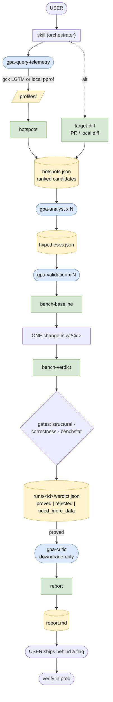

# go-perf-agent

An LLM-assisted agent that audits a Go codebase for performance and proposes optimizations that
are proven, not guessed.

It pulls real data - Tempo traces and Pyroscope profiles (via the `gcx` CLI), or a local
`go pprof` profile when neither is set up - ranks the hot code, forms hypotheses from a catalog of
common Go performance patterns, and tests each in an isolated git worktree with benchmarks. A
change is reported as proven only when `benchstat` says so, so you get a short, grounded list
worth shipping instead of speculation.

The engine is a single Go binary; the loop is a Claude Code skill plus four agents.

## How it works

The skill orchestrates; four agents do the reasoning; the Go binary does the deterministic work.
They connect through files under `.go-perf-agent/` (the source of truth), not direct messages.



Blue = LLM agent · green = Go binary command · yellow = `.go-perf-agent/` file. `bench-regression`
(base-vs-head) and `eval` (golden scenarios) are separate entry points, not shown.

## How to use

Prerequisites: Go 1.23+, `git`, and `benchstat`
(`go install golang.org/x/perf/cmd/benchstat@latest`). For production telemetry, also install and
authenticate [`gcx`](https://github.com/grafana/gcx) (`gcx auth login`) - optional but
recommended, since local profiling can mislead.

```bash
go build -o go-perf-agent .     # or: go install .
```

Run it as an agent (recommended): load this repo's `.claude/` (run Claude Code from here, or copy
`.claude/skills/go-perf-agent` and `.claude/agents/gpa-*.md` into the target repo or `~/.claude/`),
then invoke the `go-perf-agent` skill from the target module root. It asks what to audit, drives
the loop, and writes `.go-perf-agent/report.md`. See Use cases for what to tell it, and
`.claude/skills/go-perf-agent/SKILL.md` for the full loop, gate, and config.

## Use cases

The same loop runs from three starting points. A running service (telemetry-driven) is the main
one - it ranks the whole in-scope codebase by what is actually hot in production. The two
diff-driven modes reuse the same gates on a smaller, changed-code candidate set.

### 1. A production service - start from a service + time window

Invoke the skill with the service and window, e.g. "audit `tempo-ingester` over the last 1h, scope
`pkg/parquet` and `tempodb`"; it asks for anything missing (datasource UID, etc.) and runs the loop.

By hand:

```bash
go-perf-agent scope --include "pkg/parquet,tempodb" --exclude "vendor"
go-perf-agent collect-profiles --service tempo-ingester --window 1h   # cpu + alloc leaders (gcx)
#   no gcx? profile locally: go-perf-agent collect-local --pkg ./pkg/parquet --bench BenchmarkDecode
go-perf-agent collect-traces   --service tempo-ingester --window 1h --ds-uid <tempo-uid>  # optional
go-perf-agent hotspots                                                # ranked candidates
#   form hypotheses (skill/agents) -> validate each -> report
go-perf-agent report
```

After a proved change ships behind a flag, re-run `collect-profiles` + `hotspots` and confirm the
hot symbol's weight actually dropped in production - the local benchmark is necessary, not sufficient.

### 2. A GitHub PR - review the changed code

Two goals, both reuse the gate: optimize the code the PR touched, and/or check it did not make a
changed function slower.

```bash
go-perf-agent target-diff --pr https://github.com/org/repo/pull/123   # triage: changed funcs -> candidates (reads the patch via gh, no checkout)

gh pr checkout 123                                                    # to optimize: validation edits in a worktree, so check the PR out
go-perf-agent target-diff --base main                                 # changed funcs -> candidates + scope
#   form hypotheses on the changed funcs -> validate -> report

go-perf-agent bench-regression --pkg ./pkg/x --bench BenchmarkY --base main   # did the PR regress? -> REGRESSION | CLEAN | INCONCLUSIVE
```

### 3. A local diff - work in progress

The PR case for your own changes, before you open a PR - point it at uncommitted work or your
branch's commits.

```bash
go-perf-agent target-diff                 # default: working-tree changes vs HEAD (uncommitted)
go-perf-agent target-diff --base main     # or: your branch's commits vs main
#   form hypotheses on the changed funcs -> validate -> report
go-perf-agent bench-regression --pkg ./pkg/x --bench BenchmarkY --base main   # optional regression check
```

## When to use this tooling

Good fits:
- A Go service with Pyroscope/Tempo telemetry, where you want code-level wins backed by real data.
- A hot package or function (or a local profile) you want hypotheses tested on, not just listed.
- Auditing part of a large repo while keeping it off vendored/generated code.

Not a good fit:
- Micro-tuning with no signal.
- A substitute for production validation - a local benchmark win is a starting point, not proof.

## Things to keep in mind

- External tools must be on PATH: `go`, `benchstat`, `git`, `gh`, and `gcx`.
- Every finding is a hypothesis. A PROVED verdict is a local-benchmark win, not truth: production
  has different hardware, inputs, and load. Interleaved baseline/candidate runs cancel machine
  noise but not that - always re-check the same telemetry in production before trusting a change.
- Results are only as good as the machine. A noisy laptop widens confidence intervals and pushes
  borderline wins to `need_more_data`; run on an idle machine on power for the best results.
- Changes are made in throwaway worktrees under `.go-perf-agent/wt/`; proved ones are left for you
  to review (`git -C <wt> diff`) and cherry-pick.
- Without `scope`, the whole codebase is in play. Use `--include`/`--exclude` to keep the agents on
  the code you care about and off vendored, generated, or frozen packages.
- `gcx auth` is needed for production telemetry. Without it the agent profiles locally and asks you
  for a target package/function (and a benchmark, which it can author).

## Acknowledgements

Built on the Grafana LGTM stack and Pyroscope, the [`gcx`](https://github.com/grafana/gcx) CLI,
Go's `pprof` and [`benchstat`](https://pkg.go.dev/golang.org/x/perf/cmd/benchstat), and
[`alecthomas/kong`](https://github.com/alecthomas/kong).

## Credits

The Go performance pattern catalog is built from Dave Cheney's High Performance Go Workshop and
Bryan Boreham's fork:
- https://dave.cheney.net/high-performance-go-workshop/dotgo-paris.html
- https://github.com/bboreham/high-performance-go-workshop
